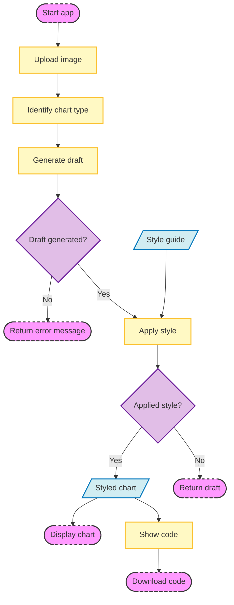

## Flowchart - Sketch to diagram application

```mermaid
flowchart TB
    %% Symbol definitions
    A([Start app]):::terminator
    B[Upload image]:::process
    C[Identify chart type]:::process
    D[Generate draft]:::process
    E{Draft generated?}:::decision
    F([Return error message]):::terminator
    G[Apply style]:::process
    H{Applied style?}:::decision
    I[/Styled chart/]:::inputOutput
    J([Return draft]):::terminator
    K([Display chart]):::terminator
    L[/Style guide/]:::inputOutput
    M[Show code]:::process
    N([Download code]):::terminator

    %% Syntax definitions
    A --> B
    B --> C
    C --> D
    D --> E
    E -- No --> F
    E -- Yes --> G
    G --> H
    H -- Yes --> I
    H -- No --> J
    I --> K
    L --> G
    I --> M
    M --> N

    %% Styling definitions
    classDef terminator fill:#f9f,stroke:#333,stroke-width:2px,color:#333,stroke-dasharray:5 5;
    classDef process fill:#fff9c4,stroke:#fbc02d,stroke-width:2px,color:#333;
    classDef decision fill:#e1bee7,stroke:#6a1b9a,stroke-width:2px,color:#333;
    classDef inputOutput fill:#d1edf2,stroke:#0277bd,stroke-width:2px,color:#333;
    classDef database fill:#e8f5e9,stroke:#2e7d32,stroke-width:2px,color:#333;
```
